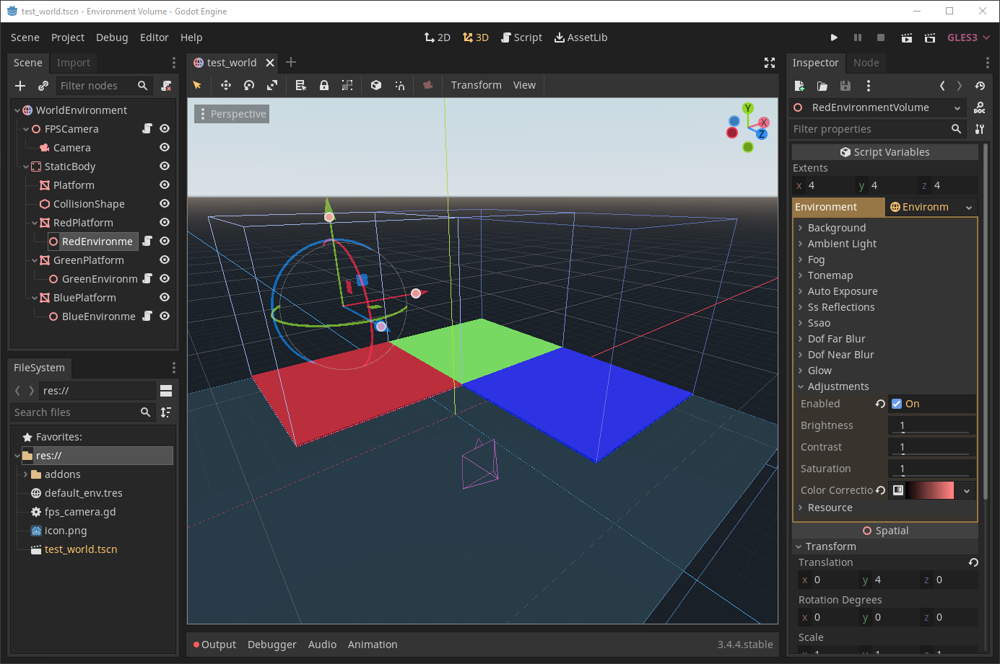

# Environment Volume

Override the environment used by cameras in parts of your Godot scenes.

This repository contains the add-on and development resources.  The main scene in this repo may serve as a basic demonstration project.



## Features

- `EnvironmentVolume` node which applies a preset environment to cameras that enter its bounds.
- Editor tools for visualizing and configuring the bounds of `EnvironmentVolumes`.
- Autoload singleton `EnvironmentBlender` who manages the effect of multiple `EnvironmentVolumes` and ensures cameras are reset to their original environment upon leaving all volumes.

## Installation

### Using the Asset Library

- Open the Godot editor.
- Navigate to the **AssetLib** tab at the top of the editor and search for
  "Environment Volume".
- Install the
  [*Environment Volume*](https://godotengine.org/asset-library/asset/1311)
  plugin. Keep all files checked during installation.
- In the editor, open **Project > Project Settings**, go to **Plugins**
  and enable the **Environment Volume** plugin.

### Manual installation

Manual installation lets you use pre-release versions of this add-on by
following its `master` branch.

- Clone this Git repository:

```bash
git clone https://github.com/DarkKilauea/godot-environment-volume.git
```

Alternatively, you can
[download a ZIP archive](https://github.com/DarkKilauea/godot-environment-volume/archive/master.zip)
if you do not have Git installed.

- Move the `addons/` folder to your project folder.
- In the editor, open **Project > Project Settings**, go to **Plugins**
  and enable the **Environment Volume** plugin.

## Usage

1. Install the plugin as directed in this document.
2. Click "Add Child Node" in your scene, find `EnvironmentVolume`, and click "Create".
3. Move the volume to the correct position in your scene and resize it using the handles to cover the area you want to apply a custom environment to.
4. In the inspector, assign a new environment to the `environment` property and configure it as you'd like.
5. By default, the current camera in the root viewport will have environments applied to it as it moves around.  If you'd like to apply effects to other cameras, or control which cameras are affected, assign those cameras to the `EnvironmentVolumeCameras` group.  Note that once you add any camera to the `EnvironmentVolumeCameras` group, then the default behavior of effecting the active camera in the root viewport will no longer apply.

## License

Copyright © 2022 Josh Jones

Unless otherwise specified, files in this repository are licensed under the
MIT license. See [LICENSE.md](LICENSE.md) for more information.
